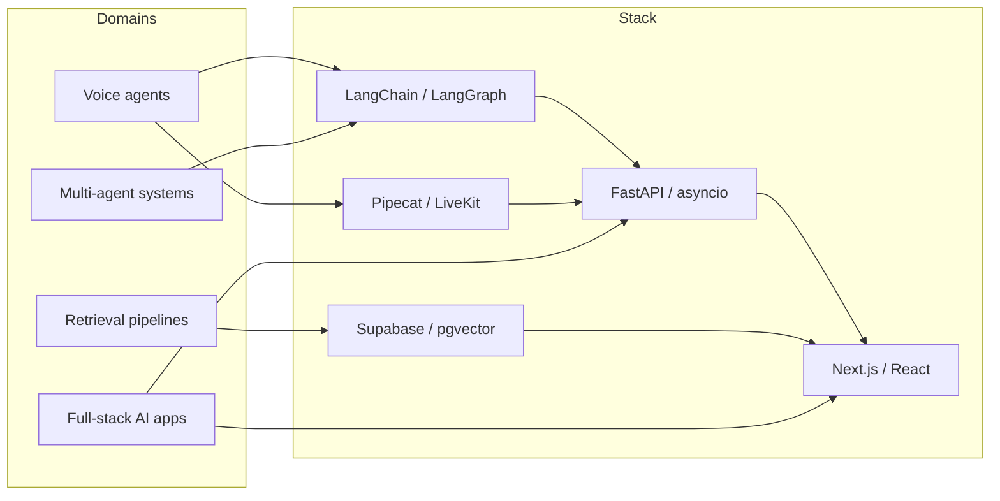

  <samp>
    <a href="https://www.linkedin.com/in/abdulrahman-elsmmany/">linkedin</a> .
    <a href="mailto:eng.elsmmany@gmail.com">email</a> .
    <a href="https://github.com/Abdulrahman-Elsmmany?tab=repositories">repos</a> .
    <a href="https://ko-fi.com/abdulrahman_elsmmany">ko-fi</a>
  </samp>

### Abdulrahman Elsmmany

I build production LLM systems — voice agents, RAG pipelines, multi-agent backends — and the full-stack apps they live inside. Currently shipping at **PsHub** (a LangGraph multi-agent system over a Next.js / Supabase B2B marketplace) and HIPAA AI at **Addis Care** in the US. Previously: a 50K-user crypto product ecosystem at **Profit 717**.

## `$ whoami`

- **Stack** — `Python` · `TypeScript` · `LangGraph` · `Pipecat` · `LiveKit` · `FastAPI` · `Next.js` · `Supabase` · `pgvector`
- **Currently learning** — voice-agent eval harnesses, real-time guardrails, MCP server patterns at scale, semantic chunking for legal/medical RAG

#### What I work on

#### Latest

<table>
<tr>
<td valign="top" width="50%">

##### Recent releases
<!-- recent_releases starts -->
- _Set up the workflow in section 7 below to populate this._
<!-- recent_releases ends -->

</td>
<td valign="top" width="50%">

##### Recent writing
<!-- BLOG-POST-LIST:START -->
- _Set up the workflow in section 7 below to populate this._
<!-- BLOG-POST-LIST:END -->

</td>
</tr>
</table>

#### Selected projects

<table>
<tr>
<td valign="top" width="50%">

##### [IRAGX](https://github.com/Abdulrahman-Elsmmany/IRAGX)

Production RAG platform with 12 retrieval strategies — hybrid BM25 + pgvector, cross-encoder reranking, streaming chat with citations.

`LangGraph` · `Next.js 16` · `Supabase`

</td>
<td valign="top" width="50%">

##### [LiveSwitch](https://github.com/Abdulrahman-Elsmmany/LiveSwitch)

Config-driven multi-agent voice orchestration. JSON-driven flow with runtime agent generation and cross-call memory.

`LiveKit` · `FastAPI` · `Pydantic 2`

</td>
</tr>
<tr>
<td valign="top" width="50%">

##### [mcp-crawl4ai-rag](https://github.com/Abdulrahman-Elsmmany/mcp-crawl4ai-rag)

MCP server with 5 RAG strategies — contextual, hybrid, agentic, reranking, and Neo4j knowledge-graph hallucination detection.

`MCP` · `Crawl4AI` · `Neo4j`

</td>
<td valign="top" width="50%">

##### [docscrape](https://github.com/Abdulrahman-Elsmmany/docscrape)

Universal docs-to-Markdown CLI for LLM context. llms.txt, sitemap, and recursive crawl strategies. Resumable.

`Python` · `async` · `Click`

</td>
</tr>
</table>

→ [More projects on my GitHub](https://github.com/Abdulrahman-Elsmmany?tab=repositories)

<code>README</code> — <em>How I work</em>

 

- **Async-first.** Design doc → spike → benchmark → ship. I write down what I'd build before I build it.
- **Evaluation before claims.** Every retrieval / agent / latency claim in my repos has a numbers table to back it.
- **Demos > slides.** I'd rather send you a 30-second Loom than a deck.
- **Open to** senior IC roles in voice AI / LLM systems / full-stack AI products. Long-running contracts (3+ months) over week-long gigs. Remote, US/EU-friendly hours.

---
The source for this README lives in <a href="https://github.com/Abdulrahman-Elsmmany/Abdulrahman-Elsmmany">/Abdulrahman-Elsmmany</a> and updates daily via a GitHub Action.

