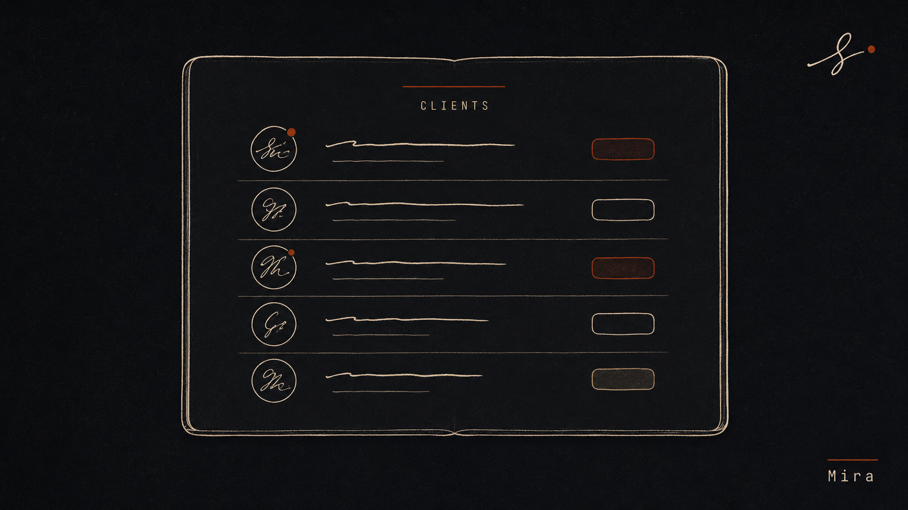
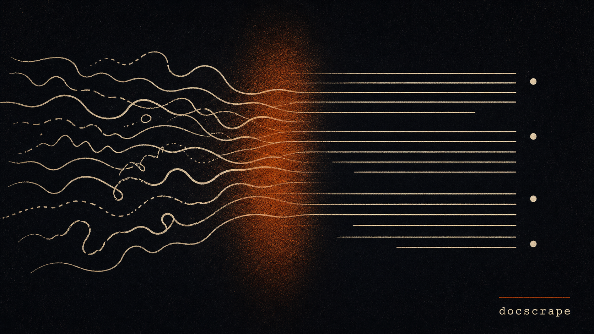
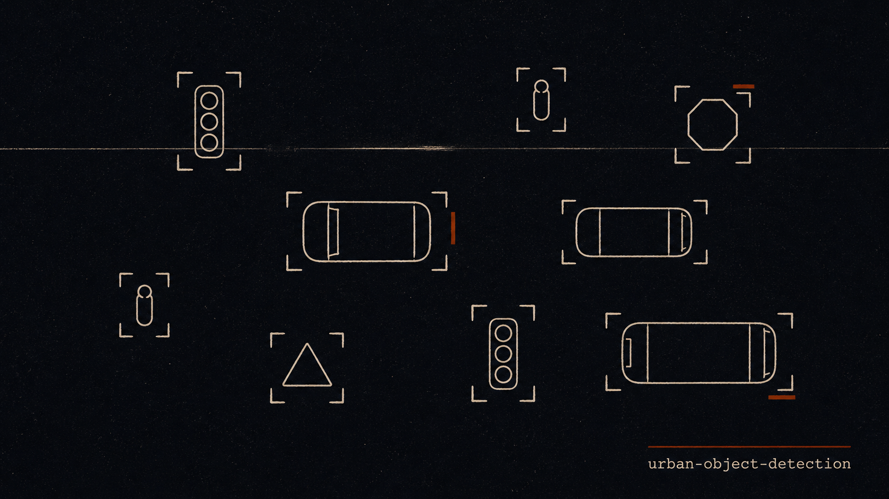
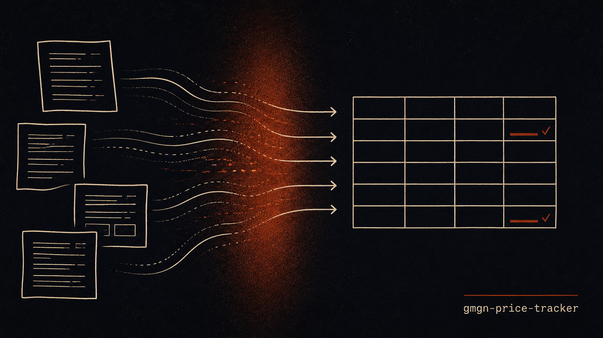

  <samp>
    <a href="https://www.linkedin.com/in/abdulrahman-elsmmany/">linkedin</a> .
    <a href="mailto:eng.elsmmany@gmail.com">email</a> .
    <a href="https://github.com/Abdulrahman-Elsmmany?tab=repositories">repos</a> .
    <a href="https://ko-fi.com/abdulrahman_elsmmany">ko-fi</a>
  </samp>

### Abdulrahman Elsmmany

I build production LLM systems — voice agents, RAG pipelines, multi-agent backends — and the full-stack apps they live inside.

Recent work: real-time voice AI on Pipecat + WebRTC with multi-provider STT-LLM-TTS, LangGraph multi-agent backends with hybrid retrieval and HITL gating, HIPAA-compliant clinical AI, and a 50K-user crypto product ecosystem with smart-contract payouts.

## `$ whoami`

- **Languages** — `Python` · `TypeScript` · `Rust`
- **AI / Agents** — `LangChain` · `LangGraph` · `Pipecat` · `LiveKit` · `Pydantic-AI` · `Firebase Genkit` (used in TS or Python depending on the project)
- **Backend** — `FastAPI` · `Node.js` · `asyncio` · `SQLAlchemy`
- **Frontend** — `Next.js` · `React` · `Tailwind` · `Tauri`
- **Data** — `PostgreSQL` · `Supabase` · `pgvector` · `Redis` · `MongoDB`
- **Currently learning** — voice-agent eval harnesses, real-time guardrails, MCP server patterns at scale, semantic chunking for legal/medical RAG
- **Remote · open to senior IC roles + select contracts**

#### What I work on

#### Selected projects

<table>
<tr>
<td valign="top" width="50%">

##### [Mira](https://github.com/Abdulrahman-Elsmmany/freelance-copilot)

Bilingual AR/EN agentic CRM for MENA freelancers. 14-node LangGraph supervisor with three retrieval mechanisms (hybrid RAG, exact-match CAG, six-layer NL→SQL), HITL-gated client drafts, and cross-lingual episodic memory in `halfvec(3072)`.

`LangGraph v1` · `Next.js 16` · `Supabase (pgvector + RLS)`

</td>
<td valign="top" width="50%">

##### [FreshGuard Vision](https://github.com/Abdulrahman-Elsmmany/freshguard-vision)

24-class produce freshness detector. YOLO26n produce localizer + DINOv3-S/16 classifier on crops and full image, with a crop ↔ full-image agreement gate. 0.948 macro F1.

`PyTorch` · `Streamlit` · `Ultralytics` · `timm`

</td>
</tr>
<tr>
<td valign="top" width="50%">

##### [LiveSwitch](https://github.com/Abdulrahman-Elsmmany/LiveSwitch)

Config-driven multi-agent voice orchestration. JSON-driven flows with runtime agent generation, intelligent handoff coordination, and cross-call memory.

`LiveKit Agents` · `FastAPI` · `Pydantic 2`

</td>
<td valign="top" width="50%">

##### [AI Media Studio](https://github.com/Abdulrahman-Elsmmany/ai-media-studio-cli)

Multi-modal AI media generation tool — Veo 3 video, Imagen images, MusicLM audio. Three interfaces: desktop GUI, CLI, REST API.

`Tauri` · `FastAPI` · `Vertex AI`

</td>
</tr>
<tr>
<td valign="top" width="50%">

##### [KIWI TTS](https://github.com/Abdulrahman-Elsmmany/KIWI-)

Professional multi-interface text-to-speech with Google Chirp 3 HD voices — 30+ voices, 28 languages. Desktop GUI, CLI, REST API.

`Tauri` · `Python` · `Google Cloud TTS`

</td>
<td valign="top" width="50%">

##### [docscrape](https://github.com/Abdulrahman-Elsmmany/docscrape)

Universal documentation-to-Markdown CLI for LLM context. Multi-strategy discovery (`llms.txt`, sitemap, recursive crawl), platform adapters for livekit / pipecat / retellai, resumable.

`Python` · `async` · `Click` · `Pydantic`

</td>
</tr>
<tr>
<td valign="top" width="50%">

##### [Urban Object Detection](https://github.com/Abdulrahman-Elsmmany/urban-object-detection)

Real-time YOLO + TensorRT object detection on urban scenes — vehicles, pedestrians, traffic lights, signs. BDD100K dataset. Streamlit interface, 30+ FPS.

`PyTorch` · `Ultralytics` · `TensorRT` · `Streamlit`

</td>
<td valign="top" width="50%">

##### [gmgn-price-tracker](https://github.com/Abdulrahman-Elsmmany/gmgn-price-tracker-Web-Scraping-)

Async web scraper pulling token prices from gmgn.ai into a sync sheet. Multi-network (BSC · ETH · SOL · ARB), UA rotation, retry, screenshots on failure.

`Playwright` · `asyncio` · `Sheets API`

</td>
</tr>
</table>

→ [More projects on my GitHub](https://github.com/Abdulrahman-Elsmmany?tab=repositories)

#### Latest

<table>
<tr>
<td valign="top" width="50%">

##### Recent releases
<!-- recent_releases starts -->
- [**freshguard-vision** v0.3.1](https://github.com/Abdulrahman-Elsmmany/freshguard-vision/releases/tag/v0.3.1) — 1mo ago
- [**freshguard-vision** v0.3.0](https://github.com/Abdulrahman-Elsmmany/freshguard-vision/releases/tag/v0.3.0) — 1mo ago
- [**freshguard-vision** v0.2.0](https://github.com/Abdulrahman-Elsmmany/freshguard-vision/releases/tag/v0.2.0) — 1mo ago
<!-- recent_releases ends -->

</td>
<td valign="top" width="50%">

##### Recently active
<!-- recent_activity starts -->
- [**markdown-preview-settings**](https://github.com/Abdulrahman-Elsmmany/markdown-preview-settings) — `CSS` · 1mo ago
- [**freelance-copilot**](https://github.com/Abdulrahman-Elsmmany/freelance-copilot) — `TypeScript` · 1mo ago
- [**freshguard-vision**](https://github.com/Abdulrahman-Elsmmany/freshguard-vision) — `Jupyter Notebook` · 1mo ago
- [**telegram-crypto-tracker**](https://github.com/Abdulrahman-Elsmmany/telegram-crypto-tracker) — `Python` · ⭐ 1 · 1mo ago
- [**gmgn-price-tracker-Web-Scraping-**](https://github.com/Abdulrahman-Elsmmany/gmgn-price-tracker-Web-Scraping-) — `Python` · ⭐ 5 · 1mo ago
<!-- recent_activity ends -->

</td>
</tr>
</table>

<code>README</code> — <em>How I work</em>

 

- **Async-first.** Design doc → spike → benchmark → ship. I write down what I'd build before I build it.
- **Evaluation before claims.** Every retrieval / agent / latency claim in my repos has a numbers table to back it.
- **Demos > slides.** I'd rather send you a 30-second Loom than a deck.
- **Open to** senior IC roles in voice AI / LLM systems / full-stack AI products. Long-running contracts (3+ months) over week-long gigs.

---

  

  The source for this README lives in <a href="https://github.com/Abdulrahman-Elsmmany/Abdulrahman-Elsmmany">/Abdulrahman-Elsmmany</a> and updates daily via a GitHub Action.

  

